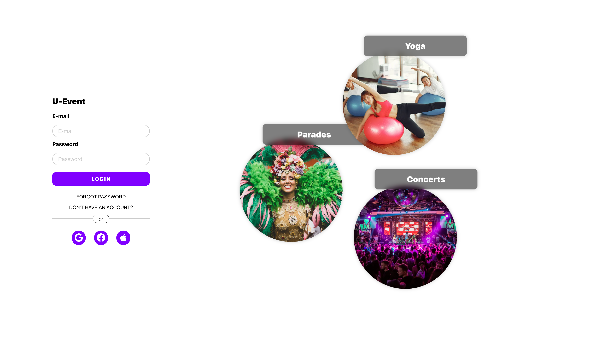
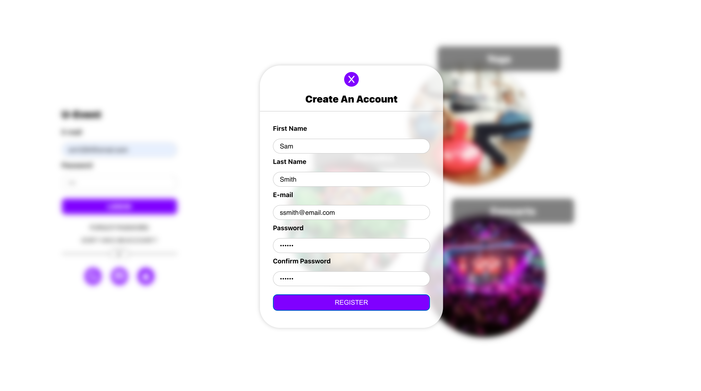
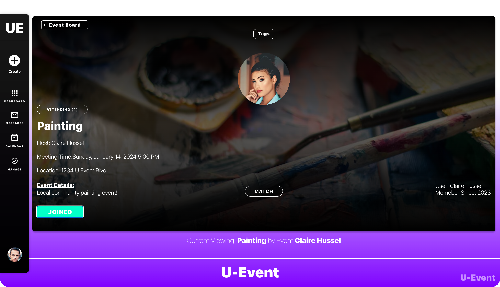
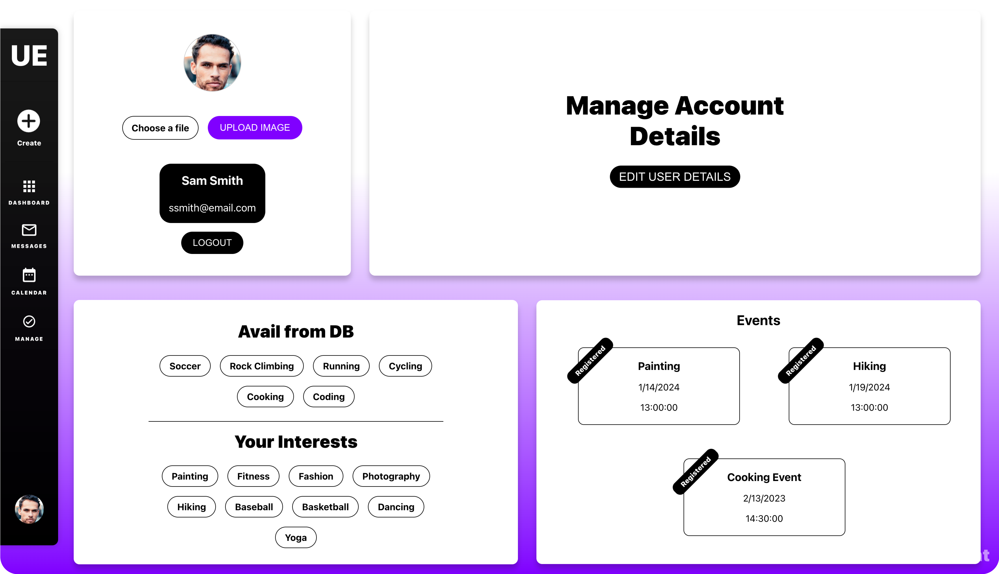
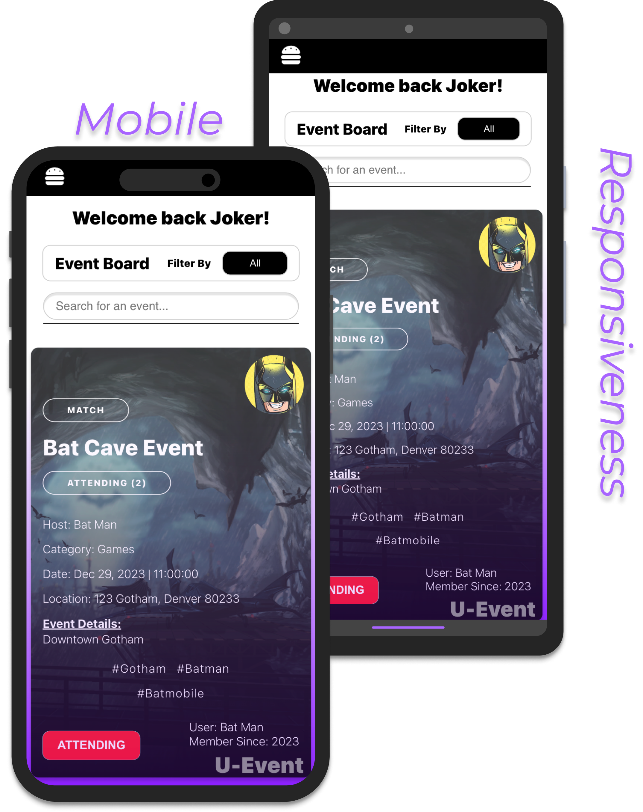

# U-Event 
#### (Event Planning Application)
### Fall Semester 2023 - (Capstone Project)

## Table of Contents

- [Overview](#overview)
- [Objective Of App](#objective-of-app)
- [Challenges and Lessons Learned](#challenges-and-lessons-learned)
- [Features](#features)
- [Methodology (Technologies Used, Deployment)](#methodology-technologies-used-deployment)
- [Deployment Practices](#deployment-practices)
- [Future Work](#future-work)
- [Contributors](#contributors)
- [Acknowledgements](#acknowledgements)

  
    

  
    

  
    

  
    

  
    

[//]: # (![App Screenshot]&#40;assests/u_event-5.png&#41;)

[//]: # (![App Screenshot]&#40;assests/u_event-6.png &#41;)

[//]: # (![App Screenshot]&#40;assests/u_event-12.png&#41;)

[//]: # (![App Screenshot]&#40;assests/u_event-9.png&#41;)

[//]: # (![App Screenshot]&#40;assests/u_event-18.png&#41;)

## Objective Of App

The primary objective of this mobile-responsive event planning application is to provide a seamless, user-friendly platform for individuals to create, RSVP, and manage events. It aims to facilitate easy organization and participation in a variety of events, ensuring users can effortlessly reserve their spot or host their own gatherings. The application's design focuses on accessibility and convenience, ensuring users can engage with the platform on any device, enhancing the overall experience of community engagement and social interaction through events.

[Back to Top](#table-of-contents)

## Challenges and Lessons Learned

Throughout our web app development, we encountered several key challenges that acted as significant learning opportunities. Deployment-wise, using a client application to manage front-end and back-end communication could enhance our deployment process. We also identified normalization improvements for more efficient data management and faced hurdles with user interest/event management and image storage. Despite making progress, ongoing work remains, particularly in refining deployment, database optimization, and innovating user management solutions. These challenges taught us valuable lessons as we strive to create a more efficient and user-friendly web app, even though we're still addressing issues like user authentication.

# Features

  
  

[Back to Top](#table-of-contents)

### User-Friendly Interface

U-Event offers a simple and intuitive interface, ideal for both experienced and new event organizers. Its ReactJS front end delivers a smooth, responsive user experience, making it easy to explore the app's features.

### Easy Event Creation

Setting up an event is straightforward with U-Event. Users can quickly input key details like date, time, and location, and add a personal touch with themed invitations and custom messages.

### Complete Event Management

U-Event includes all the tools needed for effective event management. Organizers can track RSVPs, update attendees, and manage guest lists with ease. The app's backend, built with Spring Boot and Java, ensures reliability and a stress-free management experience.

### Efficient RSVP Handling

RSVP management is effortless with U-Event. Guests can confirm attendance with a single click, allowing organizers to efficiently plan and make decisions based on guest responses.

[Back to Top](#table-of-contents)

## Methodology (Technologies Used, Deployment)

### Tech Stack

Our software thrived on React for intuitive interfaces and animations, backed by Spring Boot for a robust backend managing API endpoints, security, and data logic. PostgreSQL stored all application data securely, ensuring a seamless user experience with reliable data storage.

### Deployment

Heroku - Deploying with Heroku was seamless. Using its cloud-based Platform as a Service (PaaS), we easily scaled both front-end and back-end components without dealing with infrastructure intricacies. Heroku's hosting for the user interface and robust server environment for the application's API enabled smooth deployment and independent development, ensuring flawless integration for a polished and scalable product.

### Testing

In our web app development, we utilized Mocha, Chai, and Sinon for front-end testing, achieving a total coverage of 76%. These tools ensured smoother asynchronous code handling, clearer assertions, and precise API interaction control. On the back-end, leveraging JUnit and Mockito, we reached a total of 92% coverage with focused Java unit testing. This comprehensive testing strategy across both front-end and back-end systems resulted in an overall cumulative coverage of 85%. These tools played a pivotal role in ensuring a robust and reliable UI/UX, guaranteeing our app functions as intended.

[Back to Top](#table-of-contents)

# Deployment Practices
### Test-Driven Development (TDD)

- Test-Driven Development (TDD): Our development process strictly adhered to the Test-Driven Development (TDD) methodology throughout the project lifecycle. Prioritizing test writing before implementing new features or functionalities was a core principle. By following TDD religiously, we ensured that every aspect of the application had corresponding tests validating its functionality. This approach significantly contributed to the reliability, stability, and maintainability of our codebase. The comprehensive test suite provided a safety net, allowing us to confidently refactor and extend our code while maintaining expected behavior.

### Agile Methodology

Our team rigorously followed the Agile methodology as the cornerstone of our development process. Each stage of the project, from inception to deployment, was meticulously guided by Agile principles. Embracing iterative cycles, we consistently planned, designed, developed, tested, and deployed functionalities in short, focused increments.

Regular reviews and feedback loops were integral to our Agile process. These allowed us to swiftly adapt to evolving requirements and user feedback. By maintaining constant communication and collaboration, we ensured that the development aligned seamlessly with user needs and project objectives.

The Agile approach facilitated a dynamic and responsive development environment. It empowered us to address changing priorities efficiently, resulting in a product that met user expectations and maintained high standards of quality throughout its evolution.

[Back to Top](#table-of-contents)

## Future Work

Some things that we hope to improve on include implementing a more robust user authentication and verification system to ensure a user's credentials are secure and protected. We also intend to optimize the mobile experience even more to enhance the overall UX across all devices and improve/build upon the existing desktop UI with more fluid animations and motion design elements.

[Back to Top](#table-of-contents)

## Contributors (Team Members)

- William Hellems-Moody
- Adam Abubakar
- Eduardo Fuentes
- Muhammad Qamar

[Back to Top](#table-of-contents)

## Acknowledgements

- Dr. Dan Pittman

[Back to Top](#table-of-contents)